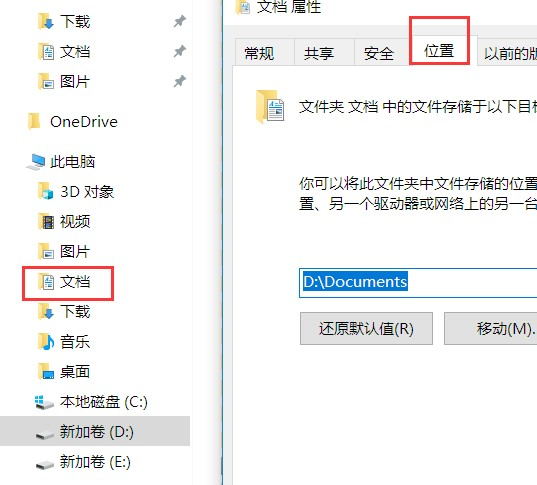

# contents
* [BIOS](#BIOS)
* [Windows](#windows)
* [N卡](#N卡)
* [7-zip](#7-zip)
* [Adobe](#Adobe)
* [DN](#DN)
* [foobar2000](#foobar2000)
* [eclipse](#eclipse)
* [NodeJS](#NodeJS)

## BIOS
开机按 F2 进入 BIOS 设置界面。  
(Enabled 意为开启，Disabled 意为关闭，调整 BIOS 设置后记得进入 Exit 选项卡选择 Save Changes and Exit 保存并退出)  
* Advanced 选项卡：高级设置   
* Intel (R) SpeedStep (TM) : 保持开启  
* Virtualization : 虚拟机技术。需要装虚拟机的同学应该开启，否则开不开随意，默认开启。 
* VT for Direct I/O : 也是跟虚拟机有关，提高虚拟机对各种外设的访问性能，默认开启。 
* Integrated NIC : 是否开启集成网卡。默认开启。 
* USB Emulation : 开启。 
* USB PowerShare :  是否开启右侧 USB 接口关机通电的功能。开启后可以使右侧 USB 接口保持通电，即使关机时也保持通电，这样可以为手机等移动设备充电。默认开启  
* USB Wake Support : 决定是否可以让 USB 设备唤醒电脑，默认关闭，是否开启根据个人需求决定。  
* SATA Operation : SATA 控制器模式。默认 AHCI ，强烈建议 AHCI。安装系统后这项不可以随意更改  
* Intel Software Guard Extensions : 一种安全技术，默认关闭。一般家庭用户根本用不到。开启会强制占用少量内存。 
* BIOS Recovery from Hard Drive :开启。 
## Windows
### 设置Documents位置
  
### 关闭update
右键个性化设置，关闭家庭组，关闭windows update  
需要更新的话，手动打开services.msc windows update  
若失败，启用下面全部  
backgroun intelligent transfer  
Windows installer  
Cryptographic Sevices  
software licensing service  
### 关闭系统保护：分区
右键电脑——属性——系统保护——配置C盘——关闭系统保护：分区
### 视觉样式
右键我的电脑——属性——高级系统设置  
只保留平滑滚动列表框，平滑屏幕自提边缘
### Dell屏幕颜色发黄
win10系统里的颜色校准来调整。  
红色减4格，绿色减一格。
### 文件夹设置
显示隐藏的文件，不勾选隐藏已知文件类型
## N卡
管理3D设置： 
全部设置——更新，关闭N卡更新。 
CUDA 全局  
三重 关  
异性 16X  
垂直同步 关  
多显示器   多显示器性能模式  
平滑处理-FXAA  关    
平滑处理-模式 程序控制  
平滑-透明度 超级取样  
最大预渲染 全局  
电源管理 高性能  
着色缓存器 开  
三线型优化 关  
各向异性采样 关  
负LOD  锁定  
质量  高质量  
## 7-zip
工具——选项，设置工作文件夹
## Adobe
### PS
#### 移动工具
方便选中PSD的任意文件：移动工具时，默认设置成自动选择-图层。  
自动选择不要勾选。
#### 编辑
编辑——首选项  
首选项——暂存盘  
首选项——单位与标尺：改像素
#### 视图
视图设置显示标尺和智能参考线  
视图——标尺  
视图——显示——智能参考线  
#### 窗口
显示字符和信息：窗口——字符，窗口——信息
#### 信息
信息点击面板，在面板选项里面改成颜色改RGB，尺寸改像素
## DN
win10 对DN的exe右键——属性——禁用全屏优化
## foobar2000
View-Layout-Enable layout editing mode  
替换成splitter  
分别换成ESlyric和playlist tabs  
## eclipse
[参考](http://www.open-open.com/lib/view/open1417487706847.html)
## NodeJS
npx启动路径不能带空格，Program Files要全部替换掉，暂时改成project\node  
查看全局安装路径： 
```
npm config ls  
```
修改全局安装路径，还要修改环境变量  
```
npm config set prefix "D:\project\node\node_global"  
```
```
npm config set cache "D:\project\node\node_cache"  
```
新建名字为NODE_PATH  
设置值为```D:\project\node\node_global\node_modules```  
在path内修改AppData\Roaming\npm  
为```D:\project\node\node_global```  

如果遇到permission not permitted，修改temp文件路径  
```
npm config set tmp  
```


